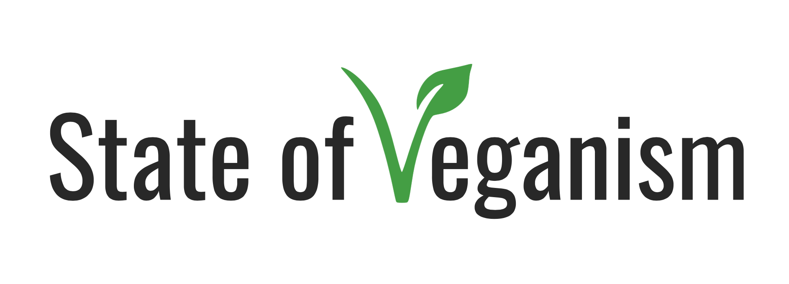
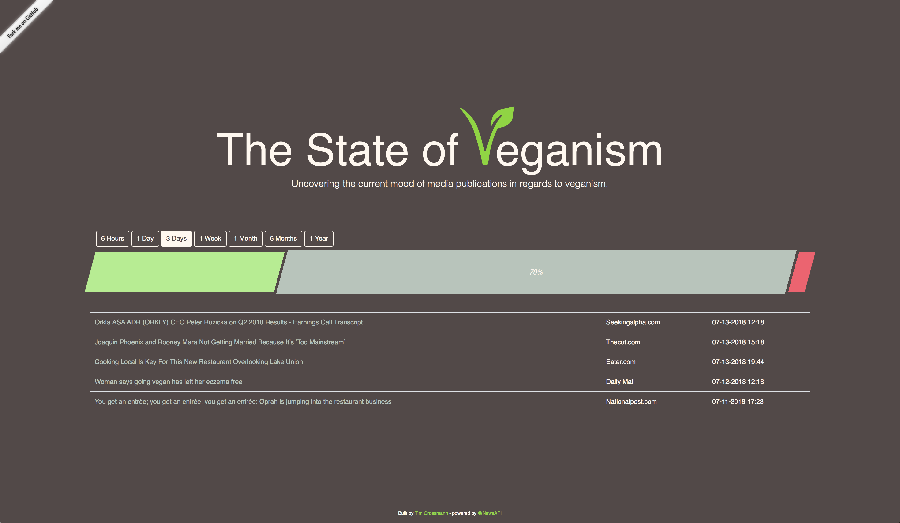
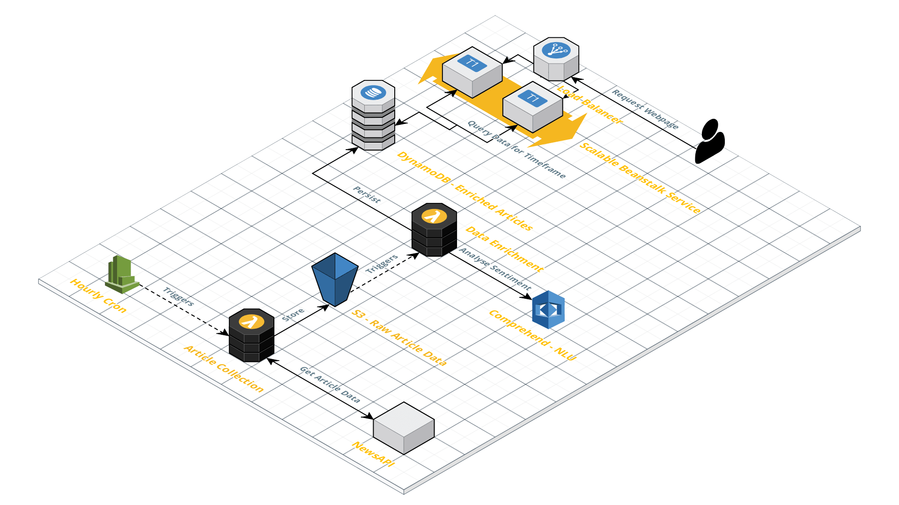

> News and Media manipulate our own opinion on topics we might not even have a thought about... A reporter writing about how bad something, in a lot of cases, is not questioned at all because they have some kind of reputation.   

### Why I built it
The main reason I built this project is to get insights into the current state of Veganism around the world based on global news.   
My hope is, that over the next months, the news about veganism get more and more positive. So I hope to see the green bar getting bigger and bigger every time I check out the webpage.
Take a look at it here: [StateOfVeganism](http://sovfrontend-env.qrg7cy6rmq.us-east-1.elasticbeanstalk.com)

### How i built it
If you're interested in seeing the process of buidling this project, I wrote an article about it on Medium.   
[Building a fully scalable architecture with AWS](https://medium.freecodecamp.org/building-a-fully-scalable-architecture-with-aws-5c4e8612565e)

Here's a preview on the final architecture that is described in detail in the mentioned article.

###### Powered by [NewsAPI.org](https://newsapi.org)
